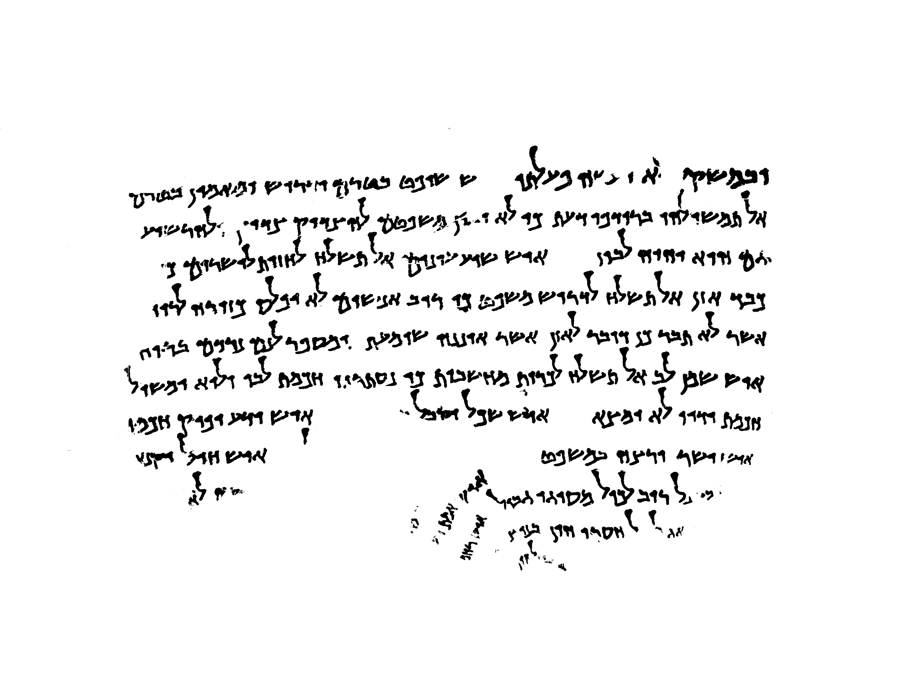
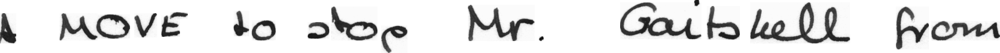

# Handwriting Recognition

This repository contains code for three handwriting recognition tasks:
1. Character segmentation on the Dead Sea Scrolls (DSS), using morphological operations.
2. Character recognition of the segmented DSS characters, using a lightweight LeNet-5 model.
3. Line recognition on a subset of the IAM dataset, using a large end-to-end TrOCR model.

The code for these tasks are grouped into two subfolders, one for tasks 1 and 2, and one for task 3.


<details>
<summary>Example input image tasks 1 & 2</summary>
<br>


</details>


<details>
<summary>Example input image</summary>
<br>


</details>


## Methods

<details>
<summary>Tasks 1 & 2</summary>
<br>


#### Segmentation
First, we wish to segment all of the handwritten characters present in the image. Given the varying image qualities of the binarised DSS images, this is very challenging. In our implementation, we first crop out the whitespace (which greatly reduces the size of the images, increasing the speed of the morphological operations), and then apply skew correction, morphological closing, Gaussian blurring, Otsu thresholding, erosion, and finally contour detection, in order to segment the characters into many smaller images.

In order to sort the segmented characters both by and within lines, we use clustering of the center y coordinate of each letter to determine the number of lines present in each particular image, then group the characters by the optimal number of lines. Within each line, the characters are sorted from left to right by their x coordinates.

#### Recognition (Classification)
We then take the segmented images, and feed then to a LeNet-5 classifier. The final output are .txt files, one per input DSS image, which contains the transcribed text. 

The LeNet-5 classifier is trained from randomised weights, on an augmented set of already-segmented DSS character images. Due to a very small number of segmented samples to train on, and a highly imbalanced dataset, we augment the training data using a random number (and order) of the following methods: rotation, shearing, warping, erosion and dilation.

</details>


<details>
<summary>Task 3</summary>
<br>

For the end-to-end text recognition task, we use a TrOCR model. This architecture makes use of a pretrained image transformer model (BEiT, based on the ViT architecutre), as well as a pretrained text transformer model (RoBERTa, based on the BERT model). 

</details>


## Instructions


<details>
<summary>Installation</summary>
<br>


If you don't have yet Anaconda installed in your system you can do so by following these steps:
<details>
<summary>Installing Anaconda</summary>
<br>

1. Download Anaconda installer

  ```wget https://repo.anaconda.com/archive/Anaconda3-2023.03-1-Linux-x86_64.sh```

2. Install Anaconda

  ```bash Anaconda3-2023.03-1-Linux-x86_64.sh```

3. Accept license terms
4. Select installation directory
5. Set path variables and restart shell

</details>


1. Create a conda environment and install the necessary dependencies (for all tasks) with:
   
   ```conda env create -f Gr9_HWR_env.yml ```

2. Activating the conda environment

   ```conda activate Gr9_HWR_env```

3. Because the model weights for task 3 are large (~4GB), we opted to submit the code for both tasks via Google Drive. A folder containing a .zip file for each task can be found at:

    https://drive.google.com/drive/folders/1zR3Mf0Bp1QORfLGXWtwzJPdShvawR3Zu?usp=sharing


</details>

<details>
<summary>Datasets</summary>
<br>

For both tasks, the datasets must consist of a folder of images. For task 3, the code is designed to run on a folder of images sourced from the IAM dataset. For tasks 1 and 2, this is the case for binarised images of the Dead Sea Scrolls, which we unfortunetly cannot provide a link to.

</details>

<details>
<summary>Running Tasks 1 & 2</summary>
<br>

1. Activate the conda environment (if you haven't already done so)

   ```conda activate Gr9_HWR_env```

2. Run the testing script. Performs segmentation, clustering, then classification.

    ```python dssRecognition.py ./test_images```

    It requires an argument for the path of the folder containing the images to be processed ("test_images/" is the placeholder for this directory). 
    Results are written to a `/results` folder in the same directory the script is located at. 
    
    Additionally, for extra viewing of our code's proceses, a '/debug' folder offers visualisatons of the results of the various steps of the segmentation and classification process, which can be enabled by passing another argument to the bash command (e.g. ```python dssRecognition.py ./test_images True```).


</details>


<details>
<summary>Running Task 3</summary>
<br>

1. Activate the conda environment (if you haven't already done so)

   ```conda activate Gr9_HWR_env```


2. Run the testing script (making sure you have downloaded the model weights provided in the installation instructions)

    ```python testing_end2end_recognizer.py -i path/to/test/images/```

    It requires an argument for the path of the folder containing the images to be processed ("Test_imgs/" is the placeholder for this directory). Results are written to `/results` folder in the same directory the script is located at. Note that this pipeline will take noticably longer to run than that of tasks 1 & 2 (a progress bar in the terminal will display how long it is expected to take).


</details>


## Results

#### Task 1 & 2

The results of the character segmentation are mixed. While we are able to seperate the characters fairly well on the clear DSS images, the results are noticeably worse on the lower-quality or grainy DSS images, as seen below.


The clustering approach for line segmentation appears promising given its simplicity, although is prone to occasional errors when there are lines with a very low number of characters, or when there are characters that straddle two lines of text. Skew corrections on the original image appears to reduce these errors slightly.


The LeNet-5 model performs well on characters that are well-segmented, and is able to accuractly distingiugh the different classes of letters. This comes as a benefit alongside the small size, low computational cost, and quick speed of this model. However, in application to the DSS images, its performance is highly reliant on the segmentation step, with often leads to undesirable results given the challenge of segmenting the tricky DSS images.


#### Task 3
As expected, the TrOCR model achieves a character error rate (CER) of just 0.0976. However, this high performance also comes with a significantly higher computational cost than the methods used in tasks 1 and 2, due to the very large size of the TrOCR model, despite operating on the smaller in size IAM images.


